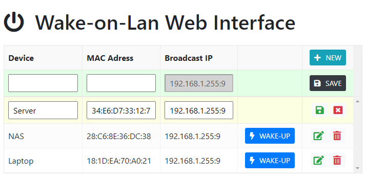

[](http://golang.org) [](http://golang.org) [](http://golang.org)


# Web interface for sending Wake-on-lan (magic packet)

Based on Samer Dhoot's project https://github.com/sameerdhoot/wolweb.

A GoLang based HTTP server which will send a Wake-on-lan package (magic packet) on local network. The request can be send using web interface or directly using an HTTP request with the mapped device name in the URL.

I needed the webserver to support binding to a specific IP for usage with a reverse proxy. I also plan to add LDAP support for access to the web interface and API.

## Bootstrap UI with JS Grid for editing data



The UI features CRUD operation implemented using [js-grid.com](https://github.com/tabalinas/jsgrid) plugin. 

### Wake-up directly using HTTP Request

/wolweb/wake/**&lt;hostname&gt;** -  Returns a JSON object

```json
{
  "success":true,
  "message":"Sent magic packet to device Server with Mac 34:E6:D7:33:12:71 on Broadcast IP 192.168.1.255:9",
  "error":null
}
```

## Configure the app

The application will use the following default values if they are not explicitly configured as explained in sections below.

| Config | Description | Default
| --- | --- | --- |
| ListenIP | Define the IP on which the webserver will listen | **0.0.0.0** |
| Port | Define the port on which the webserver will listen | **8089**
| Broadcast IP and Port | This is broadcast IP address and port for the local network. *Please include the port :9* | **192.168.1.255:9**

You can override the default application configuration by using a config file or by setting environment variables. The application will first load values from config file and look for environment variables and overwrites values from the file with the values which were found in the environment.

**Using config.json:**

```json
{
    "ip": "0.0.0.0",
    "port": 8089,
    "bcastip":"192.168.1.255:9"
}
```
**Using Environment Variables:**

*Environment variables takes precedence over values in config.json file.*

| Variable Name | Description
| --- | --- |
| WOLOLOIP | Override for default HTTP listening IP
| WOLOLOPORT | Override for default HTTP port
| WOLOLOBCASTIP | Override for broadcast IP address and port

## Devices (targets) - devices.json format
```json
{
    "devices": [
        {
            "name": "Server",
            "mac": "34:E6:D7:33:12:71",
            "ip": "192.168.1.255:9"
        },
        {
            "name": "NAS",
            "mac": "28:C6:8E:36:DC:38",
            "ip": "192.168.1.255:9"
        },
        {
            "name": "Laptop",
            "mac": "18:1D:EA:70:A0:21",
            "ip": "192.168.1.255:9"
        }
    ]
}

```
## Usage with Docker

This project includes [Dockerfile (based on Alpine)](./Dockerfile) and [docker-compose.yml](./docker-compose.yml) files which you can use to build the image for your platform and run it using the docker compose file. If interested, I also have alternate [Dockerfile (based on Debian)](.Debian_Dockerfile). Both of these Dockerfile are tested to run on Raspberry Pi Docker CE. If you want to use this application as-is, you will only need to download these two docker-related files to get started. The docker file will grab the code and compile it for your platform.

> I could not get this to run using Docker's bridged network. The only way I was able to make it work was to use host network for the docker container. See this [https://github.com/docker/for-linux/issues/637](https://github.com/docker/for-linux/issues/637) for details.

### With docker-compose
```bash
docker-compose up -d
```

### Build and run manually
```bash
docker build -t wololo .
docker run --network host -it wololo
```

### Extract the compiled application from an image
```bash
docker cp wololo:/wololo - > wololo.gz
```

## Build on Windows
I use VS Code with Go extension. To build this project on Windows:
```powershell
go build -o wololo.exe .
```
## Credits
Thank you you to Sameer Dhoot's project https://github.com/sameerdhoot/wolweb for providing the framework which I modified a little to work within constraints of environment.

Thank you to David Baumann's project https://github.com/dabondi/go-rest-wol for providing the framework which I modified a little to work within constraints of environment.
